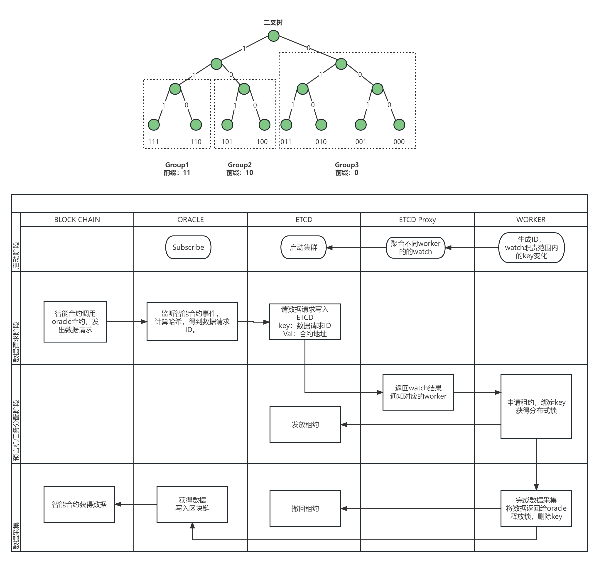

# 一、预言机架构图

# 二、常用命令
* `LIST ALL KEYS`: etcdctl  --endpoints=localhost:2379 get --prefix --keys-only ''
* `PUT JOB`: etcdctl  --endpoints=localhost:2379 put 011 '{"url":"http://www.baidu.com","pattern":" 1"}'
# 三、Quick Start
## 1. run a ETCD cluster
```sh
# your etcd executable directory
./etcd
```
## 2. run jobDeamon
```sh
cd cmd/jobDeamon
go run .
```
## 3. run worker
```sh
cd cmd/worker
go run .
```
## 4. put a job
```sh
# your etcd executable directory
./etcdctl  --endpoints=localhost:2379 put 011 '{"url":"http://www.baidu.com","pattern":" 1"}'

./etcdctl  --endpoints=localhost:2379 get --prefix --keys-only ''
```
This project is bulit for fault tolerance. You can have multiple `wokers` and `jobDeamons` running, and feel free to shut them down at any time(eg. shut a worker down when its working; shut a jobDeamon down when it detects a lock release event).

As long as there are at least one woker and one jobDeamon, every job will be done exactly once.

## 4. TODOs
- 完善job的执行逻辑，使用`pattern`作为css selector/xPath来获得网页特定内容
- 为job添加超时机制
- ID为160位的二进制数，需要使用16进制表示以节约空间
- 为worker的ID与prefix添加校验
- 为worker添加一个http server，来接受配置变更：prefix变更以及etcd endpoint变更
- 为jobDeamon添加一个http server，来接受配置变更：etcd endpoint变更
- 给出能连上实验室实验节点的ETH Client。尝试部署一个智能合约，然后监听到智能合约的event
- 尝试跑一下现有的预言机demo
  - [Oracles in Ethereum - A Simple Guide](https://kndrck.co/posts/ethereum_oracles_a_simple_guide/)
  - [简单的区块链预言机合约](https://learnblockchain.cn/article/3458)
  -----------------------
  - [weather-oracle-service](https://github.com/decent-labs/weather-oracle-service)
  - [weather-oracle-contract](https://github.com/decent-labs/weather-oracle-contract)